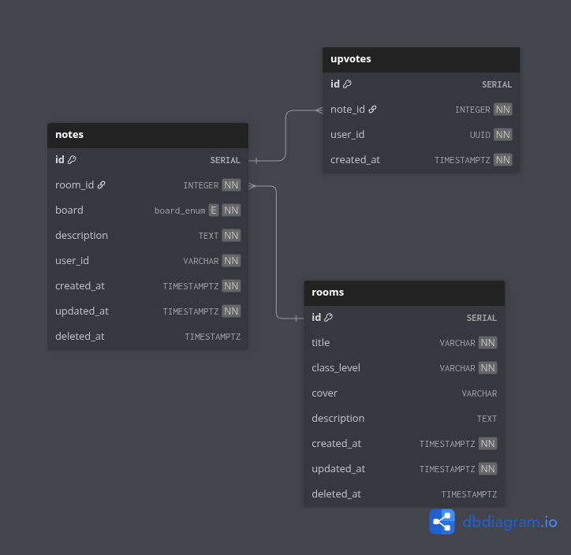

# Queen Retro Backend

This is a sprint retrospective platform inspired by [EasyRetro](https://easyretro.io/) written in rust. The project is
already following the rust idiom and best practice as much as possible. The code in this project is even cleaner rather
than my first web application rust project [old-money](https://github.com/leviis10/old-money), but it has fewer
features (there are no swagger docs and Request validation)

## ERD

## Tech Stack

- [axum](https://docs.rs/axum/latest/axum/), The Web Framework Core
- [SeaORM](https://www.sea-ql.org/SeaORM/), The ORM

## Features

- Tracing
- Environment Variables Management
- CORS Management
- Graceful Shutdown
- Standardize Success, Paginated, and Error Response
- Database Migration
- Proper Error Handling
- Actuator Endpoint
- Cookie Management
- Response Compression
- Handle Timeout
